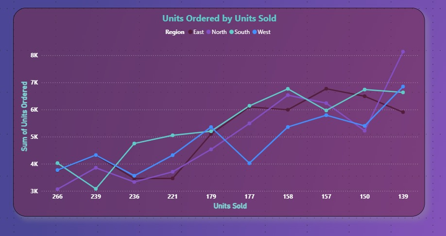
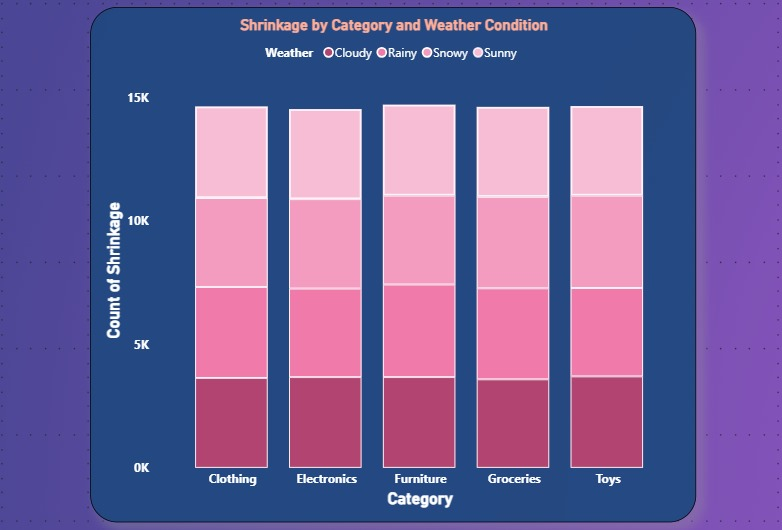
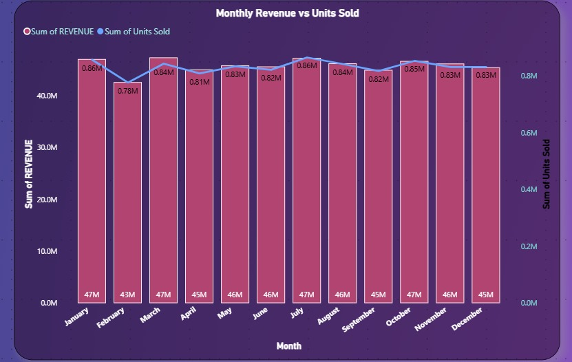

# Retail_Inventory_Analysis
Retail Inventory Project - Built an interactive Power BI dashboard to analyze revenue, shrinkage and forecast accuracy.

The insights are based on visualizations created from the dataset.

---

## 1. Units Ordered vs. Units Sold
- **Visualization:** Line Graph – *"Units Ordered by Units Sold"*  
- **Insights:**
  - No perfect 1:1 relationship between units ordered and units sold.
  - Some regions (like **North**) order more stock than they sell → indicates **overstocking/preparation**.
  - Other regions order closer to their sales → **efficient inventory management**.
## 📊 Dashboard Screenshots  

### Units Ordered vs Units Sold  
  

---

## 2. Regional Sales Performance
- **Visualization:** Table (with slicer applied)  

---

## 3. Shrinkage Analysis
- **Visualization Title:** *"Shrinkage by Category and Weather Condition"*  
- **Insights:**
  - Analyzes **inventory loss (shrinkage)** across product categories.
  - Compares shrinkage under different **weather conditions**.
  - **Shrinkage Value:** `1.08K` → Filtered region/time-based, not the total.
  - **Avg. Product Price (per Region):** `0.05K` (~$50 per product).

## 📊 Dashboard Screenshots  

### Shrinkage by Category and Weather Condition  
  

---

## 4. Monthly Revenue & Units Sold
- **Visualization:** Bar (Revenue) + Line (Units Sold)  
- **Insights:**
  - Strong **positive correlation** → More units sold = higher revenue.
  - **Seasonal Trend:**
    - Higher sales & revenue in **Jan–May**.
    - Flat trend from **June onward** → possibly due to off-season or supply limits.
    - **May** performs well but not the peak.

## 📊 Dashboard Screenshots  

### Monthly Revenue vs Units Sold  
  

---

##  Key Takeaways
- Overstocking issue in the **North** region.
- **South & West** are stable performers.
- Shrinkage varies with **weather and category**.
- Clear **seasonal trend** in revenue & sales.

